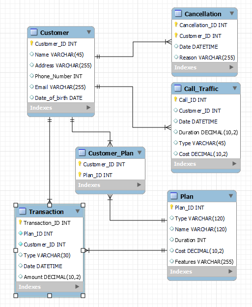

**MyMobile Database**

Example of an SQL database I created for a hypothetical mobile service provider. The database is in third normal form. Example insertion and queries are included as .txt files. The database is formatted according to the following diagram.

